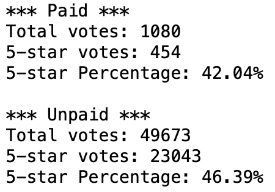

# Amazon Vine Analysis

***University of Toronto - Data Analytics Boot Camp - Module 17 - Big Data***

---

## Overview

The purpose of this project was as below:
  *load data from Amazon AWS S3 about product reviews. There were numerous datasets and I chose Electronic category.
  *Create Database and its table through pgAdmin and PySpark.
  *Extract one of tables to run some additional analysis about paid and unpaid reviews bias.

---

## Results

I ran analysis on vine_table to investigate weather there is a positive bias in paid reviews compared to unpaid ones or not.

The results was as below.

*How many Vine reviews and non-Vine reviews were there?
Vine (Paid) reviews: 1080
Non-Vine (Unpaid) reviews: 49673

*How many Vine reviews were 5 stars? How many non-Vine reviews were 5 stars?
Vine (Paid) reviews: 454
Non-Vine (Unpaid) reviews: 23043

*What percentage of Vine reviews were 5 stars? What percentage of non-Vine reviews were 5 stars?
Vine (Paid) reviews: 42.04%
Non-Vine (Unpaid) reviews: 46.39%

---

## Summary

Is there any positive bias?
It seems there is no positive bias since the Unpaid reviews has the higher percentage (46.39%) of 5-star ones compared to Paid reviews (42.04%).
If there was a positive bias, the Paid reviews should posess the higher percentage.

However I think it seems a little bit odd. Let's look it another way in an additional analysis.

### Additional Analysis

in this analysis, I consider both 4 and 5-star as good reviews since many people might score 4 and be even biased.
the results are as below:

 reviews: 1080
Non-Vine (Unpaid) reviews: 49673

*How many Vine reviews were 4 and 5 stars? How many non-Vine reviews were 4 and 5 stars?
Vine (Paid) reviews: 825
Non-Vine (Unpaid) reviews: 31781

*What percentage of Vine reviews were 5 stars? What percentage of non-Vine reviews were 5 stars?
Vine (Paid) reviews: 76.39%
Non-Vine (Unpaid) reviews: 63.98%

As we can see here, considering 4 and 5 stars as good reviews, the percentage of these good reviews in paid reviews preced by 13%. It seems there is a positive bias, but not only for 5-star ratings, rather it is for 4 and 5-star ratings combined.

It is worth mentioning that for examining the statistical significance of this difference, we can use hypothesis testing.
